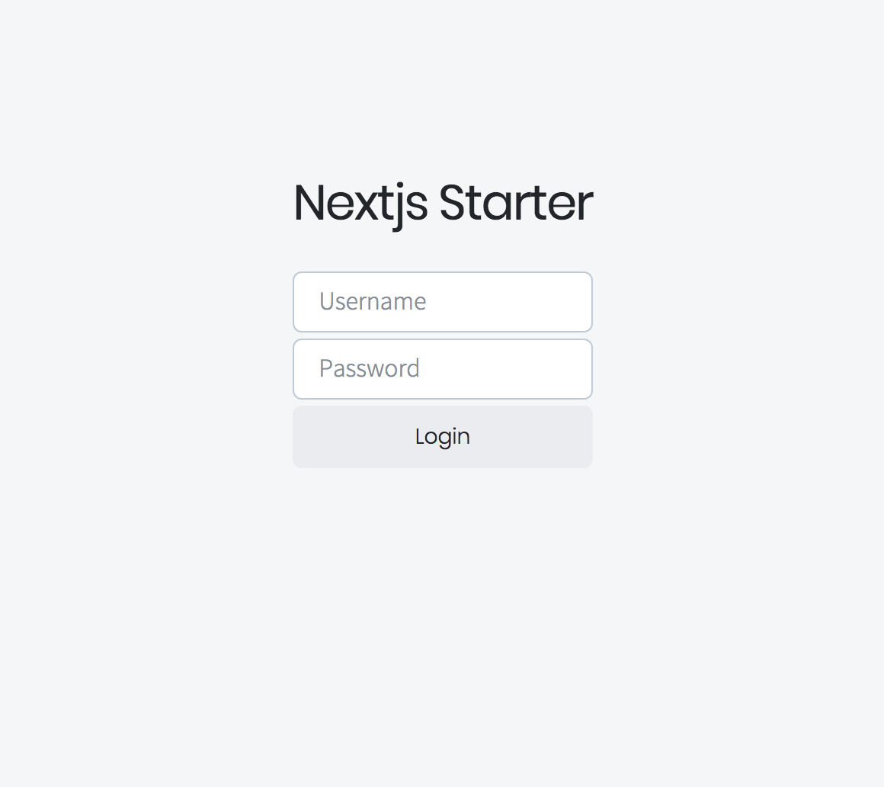
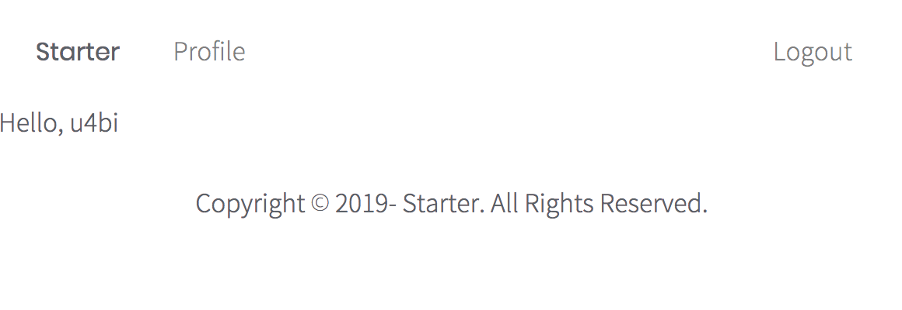

# nextjs-starter
> 🏯 A starter project for Next.js with authentication

## Demo


___



___


___

## Installation

```
git clone https://github.com/myungjaeyu/nextjs-starter.git my-app

cd my-app

yarn install

yarn dev

# http://localhost:3000
```

## Usage

1. production build `yarn build`

2. open the local server with the production file `yarn start`

## Features

- Nextjs
- Sass
- Redux-observable
- Shards-react
- File-system dynamic route
- Preload / prefetch resource
- Precache, runtime cache, offline support
- Authentication support
- SEO support

Copyright © 2019 Myungjae Yu

___

## Nextjs vendors

> | Vendor                 | URL                                                  |
> |------------------------|------------------------------------------------------|
> | next                   | https://github.com/zeit/next.js                      |
> | next-compose-plugins   | https://github.com/cyrilwanner/next-compose-plugins  |
> | next-sass              | https://www.npmjs.com/package/@zeit/next-sass        |
> | next-css               | https://www.npmjs.com/package/@zeit/next-css         |
> | next-pwa               | https://github.com/shadowwalker/next-pwa             |
> | next-seo               | https://github.com/garmeeh/next-seo                  |
> | next-redux-wrapper     | https://github.com/kirill-konshin/next-redux-wrapper |

## CSS vendors

> | Vendor                 | URL                                                    |
> |------------------------|--------------------------------------------------------|
> | node-sass              | https://github.com/sass/node-sass                      |
> | shards-react           | https://github.com/DesignRevision/shards-react         |
> | react-fontawesome      | https://github.com/danawoodman/react-fontawesome       |
> | Noto Sans CJK(경량화 버전)| https://nonria.com/post/104                            |

## State mgmt vendors

> | Vendor                 | URL                                                   |
> |------------------------|-------------------------------------------------------|
> | redux                  | https://github.com/reduxjs/redux                      |
> | react-redux            | https://github.com/reduxjs/react-redux                |
> | redux-observable       | https://github.com/redux-observable/redux-observable  |
> | universal-rxjs-ajax    | https://github.com/mcmunder/universal-rxjs-ajax       |
> | redux-actions          | https://github.com/redux-utilities/redux-actions      |
> | immutability-helper    | https://github.com/kolodny/immutability-helper        |
> | react-hook-form        | https://github.com/react-hook-form/react-hook-form    |
> | js-cookie              | https://github.com/js-cookie/js-cookie                |
> | nookies                | https://github.com/maticzav/nookies                   |

## Etc vendors
> | Vendor                 | URL                                                  |
> |------------------------|------------------------------------------------------|
> | rxjs(6.5.3)            | https://github.com/ReactiveX/rxjs/tree/6.x           |
> | axios                  | https://github.com/axios/axios                       |
> | nodemon                | https://github.com/remy/nodemon                      |

#### Directory & File Structure

```bash
nextjs-starter/
│
├── bin/
│   └── www/
│       └── index.js
│
├── components/
│   └── Layout/
│       ├── footer.js
│       ├── header.js
│       └── index.js
│
├── hoc/
│   └── withAuth/
│       └── index.js
│
├── pages/
│   ├── _app.js
│   ├── index.js
│   ├── login.js
│   │
│   └── profile/
│       └── [username].js
│
├── static/
│   ├── fonts/
│   ├── images/
│   └── styles/
│
├── store/
│   ├── constants/
│   │   └── index.js
│   │
│   ├── modules/
│   │   ├── auth.js
│   │   └── github.js
│   │
│   ├── epics/
│   │   ├── auth/
│   │   ├── github/
│   │   └── index.js
│   │
│   ├── reducers.js
│   └── index.js
│
├── next-seo.config.js
└── next.config.js
```

## License

This project is licensed under the [MIT license](LICENSE).